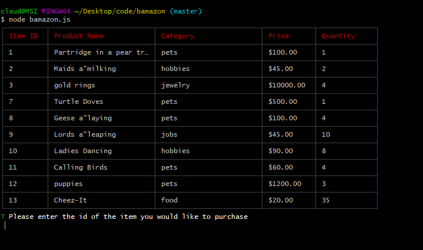

For this project, I used the mySql database and js in tandem in order to create and execute a code that allows the user to deplete stock from a stores inventory. This project uses mySql as well as inquirer in order to prompt the user what he/she would like to do, and from those prompts adds, deletes, and modifies the table

<iframe  title="" width="480" height="390" src="https://drive.google.com/file/d/1vvIxTE2kARoE0yeiQqpJhi5uETjrLFx4/view" frameborder="0" allowfullscreen></iframe>

